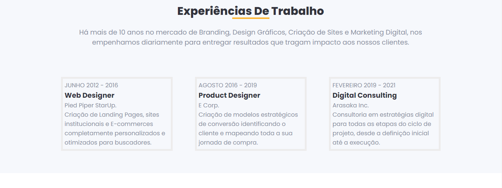

# Agência de Branding e Design digtal

## Tecnologia: 

## Pagina web Agência Branding e Design, o usuario tem a opção de alterar o tema de modo-claro para modo-escuro, para facilitar em momentos que já esta com a visão cansada. 

## Objetivo:
### - Criar uma pagina web que contenha múltiplos componentes. Ela terá um botão com a capacidade de alterar o tema de todos os seus componentes.
### - Utilizar props para enviar dados de um componente pai para um componente filho.
### - Utilizar o props para enviar um state para um componente filho.
### - Manipular um state dentro de um componente filho.
### - Criar uma funcionalidade que permite alterar o tema de todos os componentes da página através da ação do usuário.

## Oque aprendi.
### - Coloquei em pratica o uso de componentes, State Hook, evento Onclick, Props.

### 
### 
### 
### 
### 
